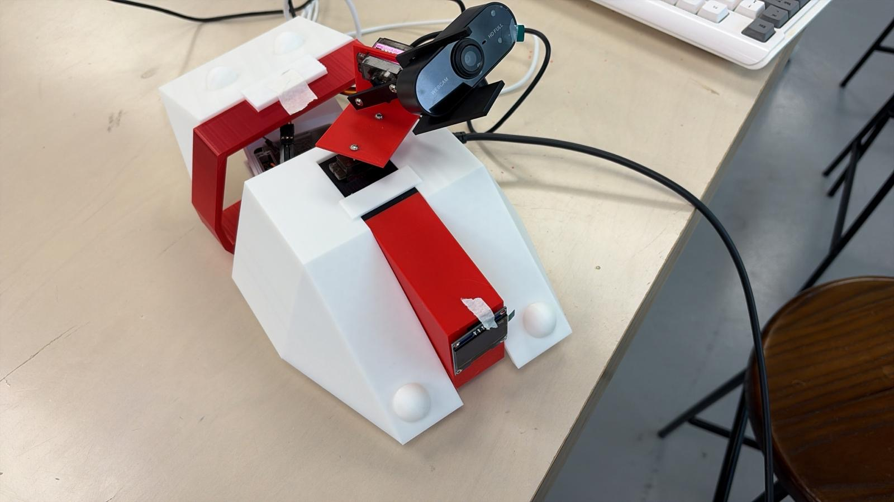
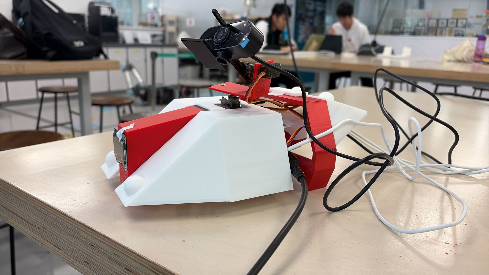
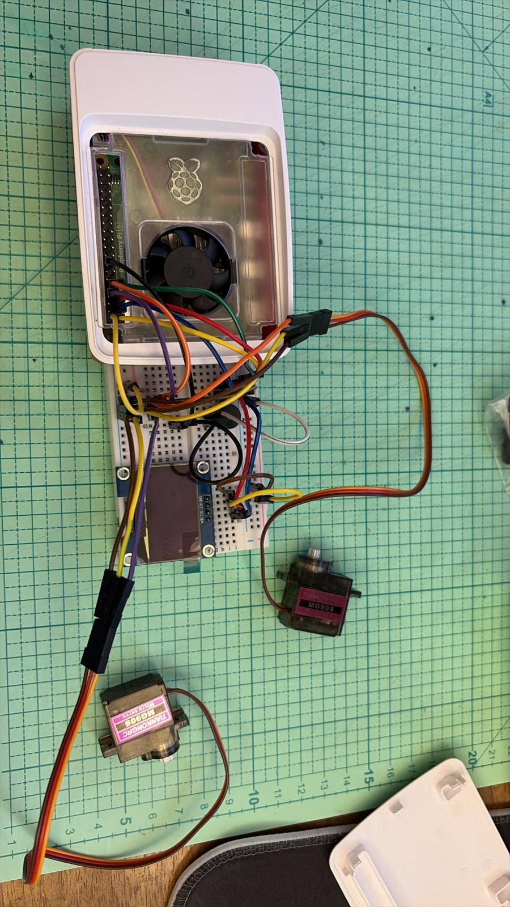
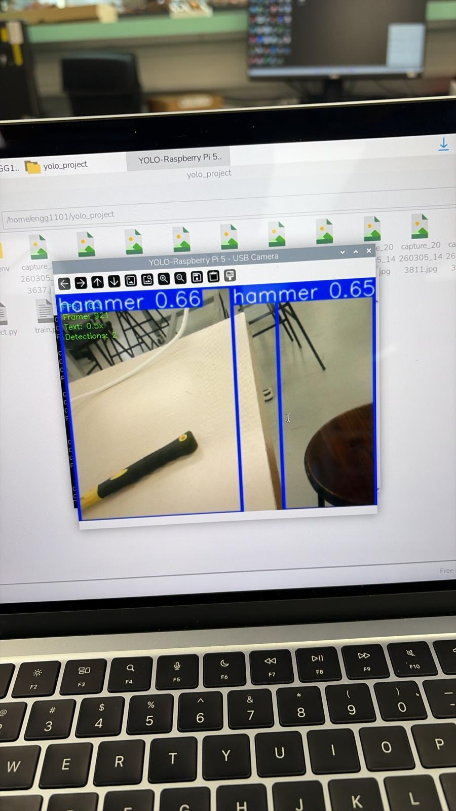
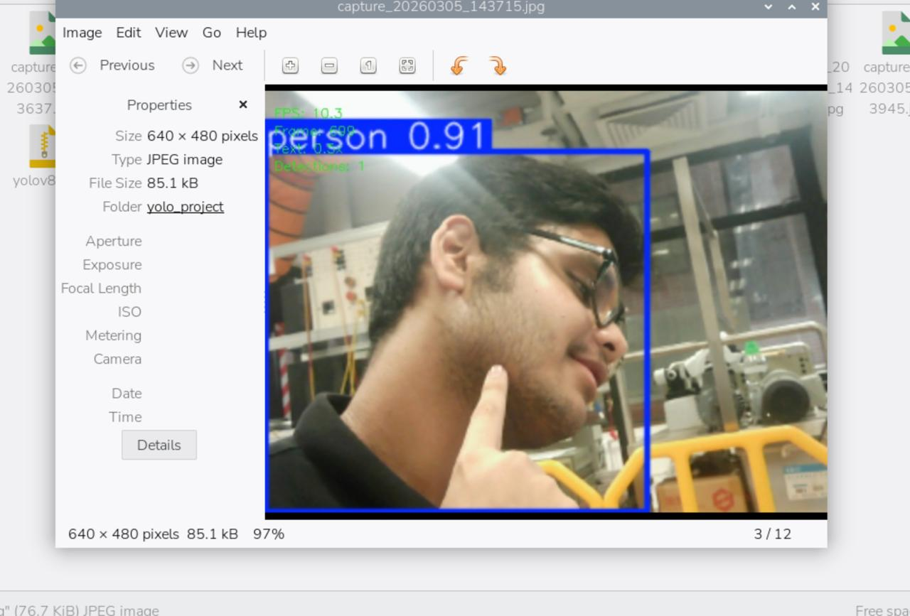

# 🔬 Vision Based Surgical Tool Tracking System

> 🚧 **Work in Progress** — ENGG1101 Engineering Challenges | The University of Hong Kong | January 2026 – May 2026

An autonomous aerial tracking system that uses computer vision to detect and monitor surgical instruments in real time, designed to assist surgeons by providing continuous tool visibility during procedures.

---

## 📹 Live Demo

[▶ Watch the live demo here](https://github.com/devggupta/surgical_tool_tracker/blob/main/yolo-pan-tilt-object-tracking-live-demo.mp4)

---

## 📸 Gallery

| Complete Build | Camera Mount | Wiring Setup |
|---|---|---|
|  |  |  |

**Detection in action:**

---

## ✨ Features

- **Real-time detection** — YOLOv8-based computer vision model detects and tracks surgical tools via a Raspberry Pi 5-mounted camera
- **Motorized tracking** — 2-DOF servo-actuated camera mount automatically follows detected instruments
- **Alert system** — OLED status display and buzzer notify surgeons when a tool exits the camera's field of view

---

## 🛠 Tech Stack

| Category | Tools |
|---|---|
| Hardware | Raspberry Pi 5, MG90S servo motors, OLED display, buzzer |
| Computer Vision | Python, OpenCV, YOLOv8 |
| CAD & Fabrication | Fusion 360, 3D printing |

---

## ⚙️ How It Works

1. Camera mounted on a 2-DOF servo rig captures a live video feed
2. YOLOv8 model processes each frame to detect surgical instruments in real time
3. Servo motors adjust the camera angle to keep the tool in frame
4. If the tool exits the field of view, the OLED display and buzzer trigger an alert

---

## 👥 Team

Built by a 6-member cross-disciplinary team across Civil, Mechanical, and Computer Engineering over a structured 12-week development timeline at The University of Hong Kong.

---

## 📚 Course

ENGG1101 — Engineering Challenges, The University of Hong Kong
